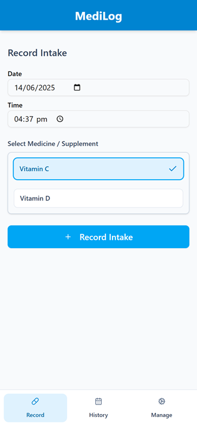
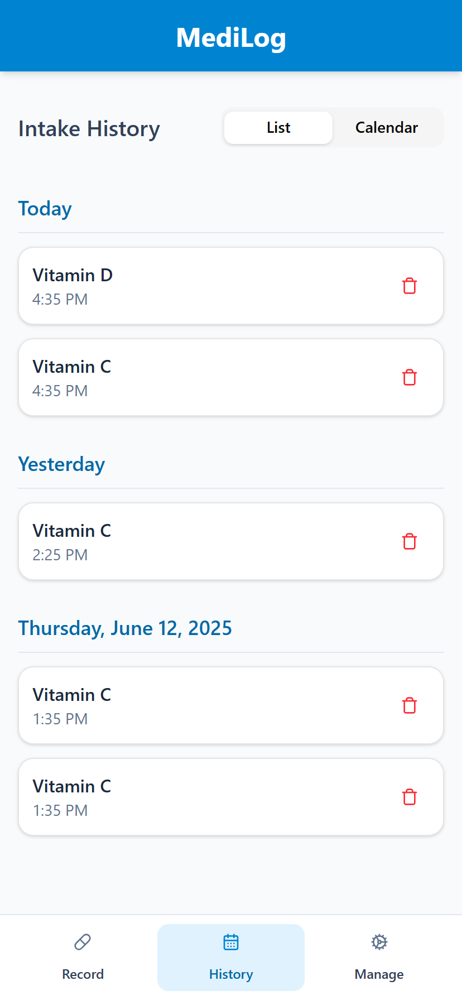
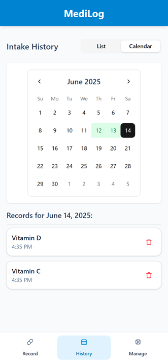
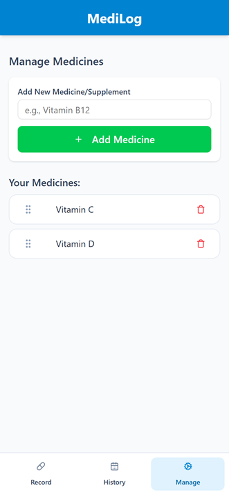

# MediLog

MediLog is a simple and intuitive web application designed to help you track your medicine and supplement intake. Built with React, TypeScript, and Tailwind Shadcn UI components, it provides a clean interface to record your daily doses, manage your list of medicines, and review your intake history.

> ⚠️ **IMPORTANT WARNING**  
> MediLog is intended **only** for casual, non-critical recording of your medicine and supplement intake.  
> **Do not** rely on MediLog for tracking essential or life-critical medication schedules.  
> **All data** is stored **locally** in your browser’s `localStorage`. Clearing your browser data (cookies, site data, or cache) will permanently erase **all** your MediLog entries. There is no cloud sync or cross-device backup.  

## Live Demo

Try it out here:  
https://kitckso-medilog.netlify.app/

## ⚙️ Installation and Setup

To get the project up and running on your local machine, follow these steps:

1.  **Clone the repository:**
    ```bash
    git clone https://github.com/kitckso/medilog.git
    cd medilog
    ```

2.  **Install dependencies:**
    This project uses `bun` as its package manager. If you don't have Bun installed, you can find instructions [here](https://bun.sh/docs/installation).
    ```bash
    bun install
    ```

3.  **Run the development server:**
    ```bash
    bun dev
    ```
    The application will be available at `http://localhost:5173` (or another port if 5173 is in use).

4.  **Build for production (optional):**
    ```bash
    bun build
    ```
    This will create a `dist` folder with the production-ready build.

## 🚀 Usage

Upon launching the application, you'll be greeted with the "Record Intake" view.

1.  **Record View**:
    *   If no medicines are added yet, you'll be prompted to navigate to the "Manage" section to add some.
    *   Select the date and time for the intake.
    *   Choose a medicine from your list.
    *   Click "Record Intake" to save the entry. A success message will briefly appear.

2.  **History View**:
    *   Navigate to the "History" tab using the bottom navigation.
    *   View your intake records in a chronological list.
    *   Switch to "Calendar" view to see which days have recorded intakes (highlighted in green).
    *   Click on a specific day in the calendar to see records for that day.
    *   Use the trash icon next to any record to delete it. A confirmation dialog will appear.

3.  **Manage View**:
    *   Navigate to the "Manage" tab using the bottom navigation.
    *   Use the "Add New Medicine/Supplement" form to add new items to your list.
    *   Your existing medicines are displayed below. Use the trash icon next to a medicine to delete it from your list. Note that deleting a medicine here does not remove its past intake records.

## 📸 Screenshots

Here are some screenshots of MediLog running on a mobile device:

<div style="display: flex; justify-content: center; gap: 15px; margin-top: 20px; overflow-x: auto; padding-bottom: 10px;">
    
    
    
    
</div>

## 🤝 Contributing

Contributions are welcome! If you have suggestions for improvements, bug fixes, or new features, please open an issue or submit a pull request.

## 📄 License

This project is open-source and available under the [MIT License](LICENSE).